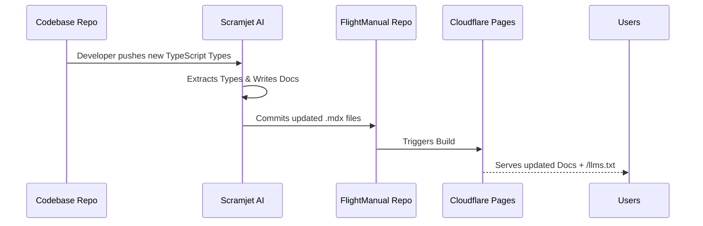

<!-- The Visual Hook -->
<div align="center">
  
  
  <h1>FlightManual</h1>
  <p><strong>A premium, open-source documentation engine for the agentic era.</strong></p>
  <p>Get Mintlify-tier aesthetics and instant local search, natively optimized for Cloudflare Pages. 100% free.</p>

  <!-- The 6-Badge Array -->
  <a href="https://flightmanual.scramjet.io" target="_blank"></a>
  <a href="https://deploy.workers.cloudflare.com/?url=https://github.com/scramjetio/flight-manual"></a>
  <a href="https://scramjet.io" target="_blank"></a>
  <a href="https://discord.gg/scramjetio" target="_blank"></a>
  <a href="https://github.com/scramjetio/flight-manual/stargazers"></a>
  <a href="https://github.com/scramjetio/flight-manual/actions"></a>
</div>

---

## ⚡️ Why FlightManual?

Most documentation frameworks look like they were built in 2010. The ones that look modern are expensive, proprietary SaaS products that lock you in.

**FlightManual** bridges the gap. Built on top of [Astro Starlight](https://starlight.astro.build/), we've layered a premium dark-mode design system, interactive API playgrounds, and AI-native exports out-of-the-box. 

### Features
- 🎨 **Premium Aesthetics:** Deep dark mode, Inter typography, and glassmorphism components.
- 🔍 **Instant Search:** Client-side, zero-config search powered by Pagefind.
- 🛠 **API Ready:** Interactive API reference generation powered by Scalar.
- 🤖 **AI-Native:** Automatically generates `/llms.txt` and `/llms-full.txt` during the build process so AI agents can read your docs instantly.
- 🚀 **0ms Latency:** Configured specifically for deployment to Cloudflare Pages edge network.

## 🎥 In Action
> **[TODO]:** Insert a 5-second WebP or GIF here showing the interactive API playground or instant search in action.
*(Placeholder: ``)*

## 🚀 Quick Start

**Prerequisites:** Node.js >= 18.0

Deploy your own premium documentation site in seconds:

```bash
git clone https://github.com/scramjetio/flight-manual.git my-docs
cd my-docs
npm install
npm run dev
```
Your docs are now running at `http://localhost:4321`.

## 📂 Project Structure

- `src/content/docs/`: Write your markdown (`.md` or `.mdx`) files here.
- `src/styles/custom.css`: The central design system. Tweak colors and typography here.
- `astro.config.mjs`: Configure your sidebar, branding, and site metadata.

## 🤖 The Trojan Horse: Powered by Scramjet

Writing docs manually is tedious. FlightManual is designed to be the "Publishing Surface" for **Scramjet**, our event-driven content pipeline.

If you don't want to write docs by hand, you can use Scramjet to:
1. Watch your GitHub Repositories.
2. Extract your TypeScript/OpenAPI types.
3. Automatically write `.mdx` files using AI.
4. Commit them directly into this repository.

*Learn more about automating your documentation with Scramjet [here](https://scramjet.io).*

<details>
<summary><strong>🗺️ View Architecture Diagram</strong></summary>


</details>

## ☁️ Deployment

This project is pre-configured for **Cloudflare Pages**.

1. Push this repository to GitHub.
2. Go to the Cloudflare Dashboard -> Pages -> Connect to Git.
3. Build command: `npm run build`
4. Build output directory: `dist`

## 📄 License
MIT © The Scramjet Team
