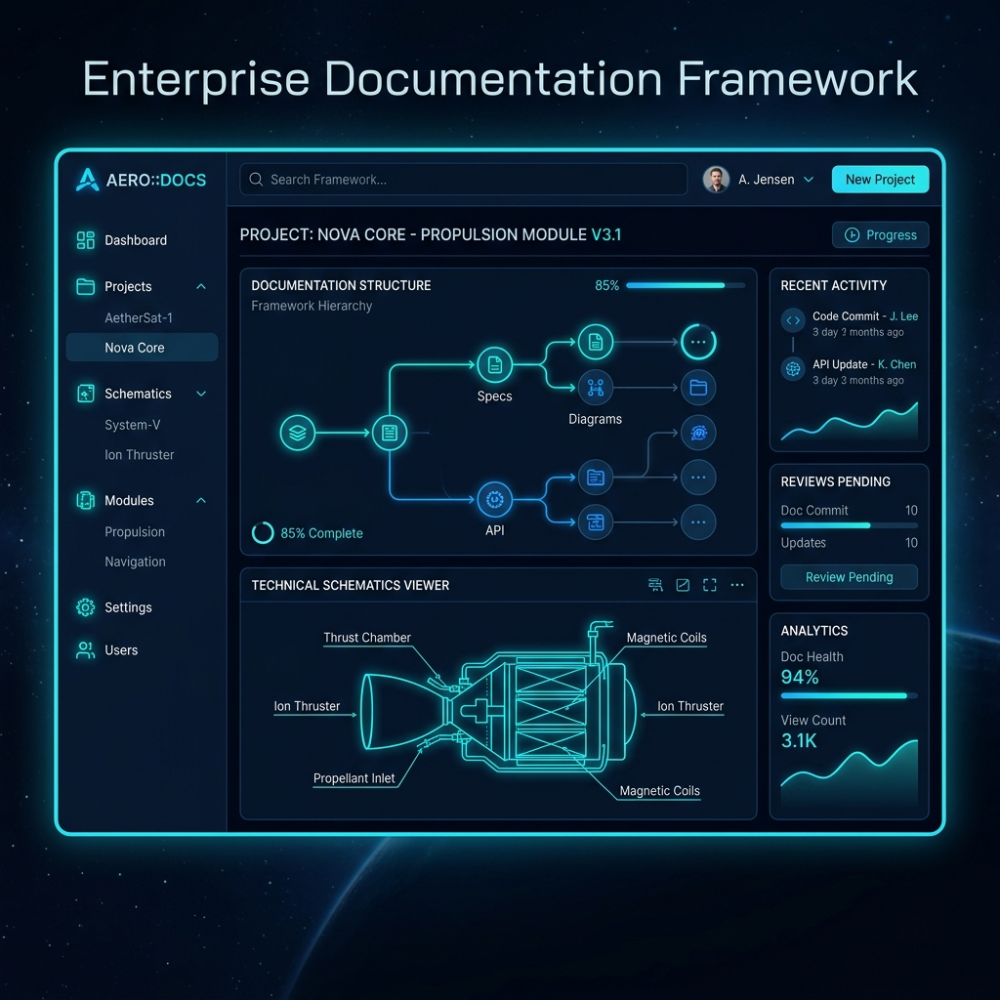
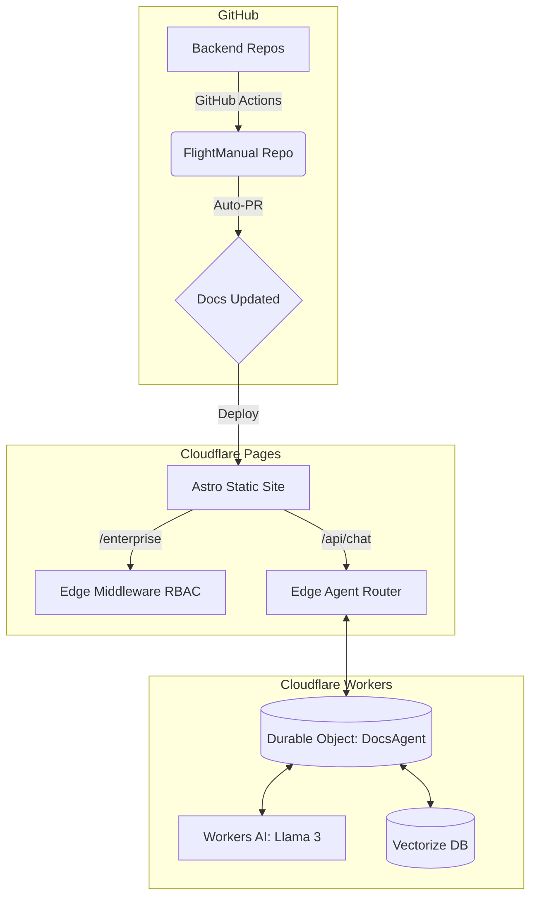

<!-- The Visual Hook -->
<div align="center">
  
  
  <h1>FlightManual</h1>
  <p><strong>The production-grade, self-documenting framework featuring Edge RBAC, CI/CD automation, and a native AI Agent.</strong></p>
  
  <!-- The 6-Badge Array -->
  <a href="https://flightmanual.scramjet.io" target="_blank"></a>
  <a href="https://deploy.workers.cloudflare.com/?url=https://github.com/scramjetio/flight-manual"></a>
  <a href="https://scramjet.io" target="_blank"></a>
  <a href="https://discord.gg/scramjetio" target="_blank"></a>
  <a href="https://github.com/scramjetio/flight-manual/stargazers"></a>
  <a href="https://github.com/scramjetio/flight-manual/actions"></a>
</div>

---

## ⚡️ The Problem
Existing documentation templates (like Docusaurus or vanilla Astro) are too basic. You are forced to manually write and maintain your API schemas. They offer no built-in access-control (RBAC) for enterprise clients, and you have to pay third-party SaaS vendors $100+/month just to get a floating AI chatbot like Mintlify or Markprompt.

## 🌟 The Solution (FlightManual)
FlightManual is an open-source, "Venture-Backed SaaS" grade documentation engine built on top of Astro Starlight. It solves the enterprise documentation problem natively:
* **CI/CD Automation**: GitHub Actions automatically pull schemas from your backend repos and open Pull Requests.
* **Edge RBAC**: Cloudflare Pages Middleware locks down private `/enterprise` directories at the edge.
* **Native Stateful AI**: A fully integrated Chatbot powered by `assistant-ui` and Cloudflare Durable Objects. You own the Vectorize database and the Llama 3 compute, paying $0 to third-party wrappers.

## 🎥 In Action
> **[TODO]:** Insert a 5-second WebP or GIF here showing the UI being interacted with.
*(Placeholder: ``)*

## 🚀 Quick Start

**Prerequisites:** Node.js >= 18.0

```bash
git clone https://github.com/scramjetio/flight-manual.git
cd flight-manual
npm install
npm run dev
```

To enable the AI Agent and Vector DB integration, create your database and deploy:
```bash
npx wrangler vectorize create flight-manual-docs --dimensions=768 --metric=cosine
npm run deploy
```

<details>
<summary><strong>🗺️ View Architecture Diagram</strong></summary>


</details>

## 📄 License
MIT © The Scramjet Team
