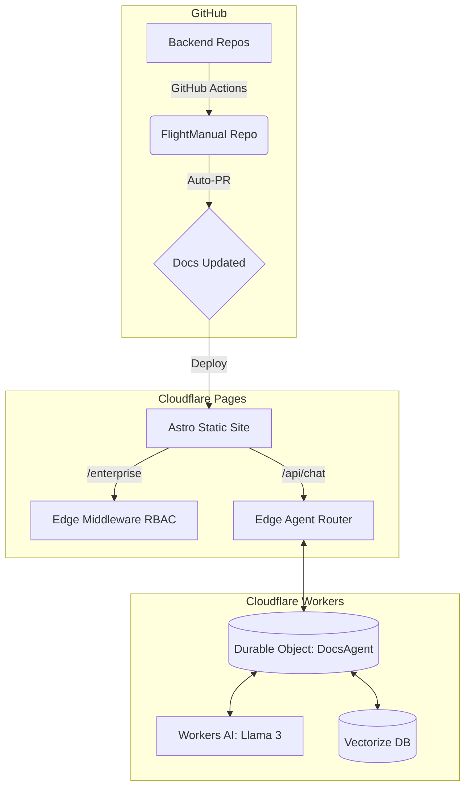

import { Card, CardGrid } from "@astrojs/starlight/components";

## Overview

**FlightManual** is a deterministic, code-driven documentation toolkit. It provides automated API ingestion, native Zod parsing, and an integrated edge presentation layer.

## Technology Stack

<CardGrid>
  <Card title="Astro Starlight" icon="astro">
    Static site generator optimized for documentation. Markdown/MDX content, automatic navigation, built-in search.
  </Card>

  <Card title="Cloudflare Pages" icon="cloud">
    Global edge deployment for static UI assets. Provides blazing fast delivery of HTML/CSS.
  </Card>

  <Card title="Cloudflare Durable Objects" icon="puzzle">
    Stateful Cloudflare Workers that persist the AI Agent's chat history directly on the edge.
  </Card>

  <Card title="GitHub Actions CI/CD" icon="rocket">
    Automated ingestion pipeline that pulls schemas from your backend microservices and creates automated Pull Requests.
  </Card>
</CardGrid>

## How It Works

FlightManual utilizes **Cloudflare Pages**, but it leverages the full power of **Cloudflare Workers**.

By placing our server-side logic in the `functions/` directory, Cloudflare automatically compiles those files into a hidden Cloudflare Worker attached to our static site. This allows us to serve static HTML at edge speeds, while running complex backend compute (RBAC and AI) in the exact same repository.



### Feature Architecture

| Feature | Component | How It Works |
|---|---|---|
| Auto-Ingestion | GitHub Actions | `docs-sync.yml` clones backend repos and extracts Markdown/Zod schemas. |
| AI Chatbot | `assistant-ui` + Durable Objects | Vercel AI SDK streams Llama 3 responses from a stateful Cloudflare Worker. |
| Edge Security | Cloudflare Middleware | `_middleware.ts` intercepts requests to `/enterprise/` and enforces RBAC tokens. |
| API Playground | Scalar | React component embedded in MDX to test endpoints live. |
| AI Readability | llms-txt integration | Post-build hook generates markdown files optimized for LLM scrapers. |

## Extending

### Adding Custom Components

Create Astro components in `src/components/` and import them in your MDX:

```astro
---
// src/components/StatusBadge.astro
const { status } = Astro.props;
const color = status === 'active' ? 'green' : 'gray';
---
<span class={`badge badge-${color}`}>{status}</span>
```

```mdx
---
title: My Page
---
import StatusBadge from '../../components/StatusBadge.astro';

The service is currently <StatusBadge status="active" />.
```

### Custom Integrations

Add Astro integrations to `integrations/` and register them in `astro.config.mjs`.
See `integrations/llms-txt.js` and `integrations/analytics.js` for examples.
